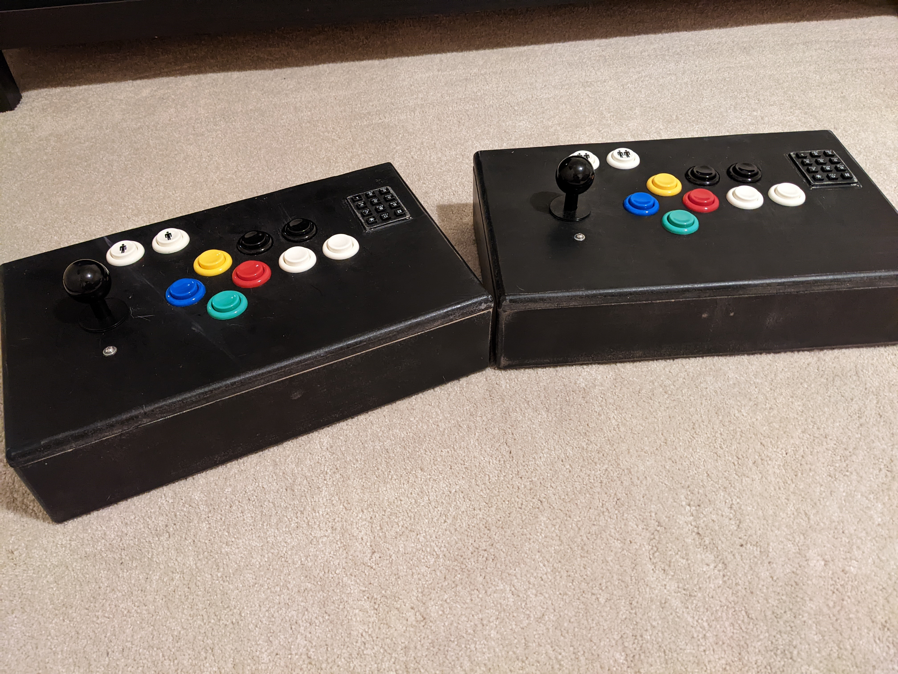

# Retro Game Controller
Code for making an Arduino Leonardo act as a Custom Game Controller

## Backstory
For several years now, I've been getting into retro gaming. Playing 
video games from when I was a kid and into college.  This 
essentially covers the 80s and early 90s.  Growing up, I 
had several friends who had the Atari 2600.  I of course 
had the Intellivision.  That was a great system that had a unique
controllers.  This means that no controller today can function
the way that one did.

This project was born from wanting to play all those games from when
I was a kid using one controller.  What makes this controller
different of course is the keypad.

## Lessons Learned from Version 1
Version 1 of this was big, clunky, and not well-made, kind of
like everything else from the 80s.  My woodworking skills were
subpar at best, now they're, well, still not great, but I'm
getting better. Version 1 also had a major functional defect. The
infamous button ghosting problem. For those not familiar, this is
where you press a certain combination of buttons and then a 
seemingly other random button gets pressed all on its own. I've 
addressed this by adding diodes to my physical build of the 
controller.  Unfortunately, the keypad that I've used still has 
this issue. Apparently, there are no built-in diodes within that 
physical module. The good news is that the Intellivision system 
really never needed you to press more than 1 of those buttons
at a time unless you were trying to pause the game (1 and 9). All
that said, on to this, version 2.

## Pictures
[Pictures of the build process.](pictures.md)

## References
- Joystick Library
  - This is a project from [MHeironimus/ArduinoJoystickLibrary](https://github.com/MHeironimus/ArduinoJoystickLibrary) 
  on GitHub that does most of the hard work for you. Great examples 
  to follow and easy to implement!
- Keypad Library
  - This is a project from [Chris--A/Keypad](https://github.com/Chris--A/Keypad)
  on GitHub. Not as well documented as the Joystick Library, but
  some really easy to follow examples. The one that helped me the
  most was the MultiKey example.
- I decided not to use the [Adafruit Keypad Library](https://github.com/adafruit/Adafruit_Keypad)
  - I tried to go with this keypad library first since the actual
  keypads I used were from Adafruit. I decided against it though
  since I was having trouble getting the multi-key press to work.

## Joystick, Button, and Keypad Mappings
[A listing of mapping the physical switches, to physical pins, 
for logical programming.](mappings.md)

## Materials Used
[Materials used in construction](materials.md)

