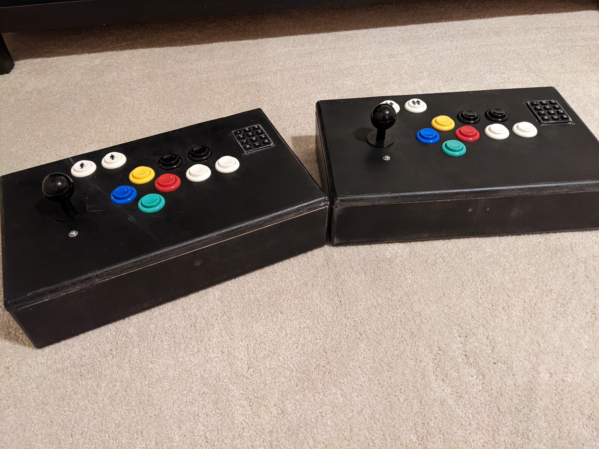

# Pictures

Here are some progressive images of the construction process

Getting the boxes ready for paint...

First coat of paint...

Sanded...

Waxed...

Added hinges!

Added latches!

Now the buttons...

Added the Leonardo...

The shield that will plug into the Leonardo which will
also have the wires from the buttons soldered to it.

Prototyping the connections.  This happened long before the 
construction of the boxes.

Finally soldered all connections and the shield is plugged
into the Leonardo.  Yes, I could have managed the wires better.

Single finished controller...

Both finished controllers...

